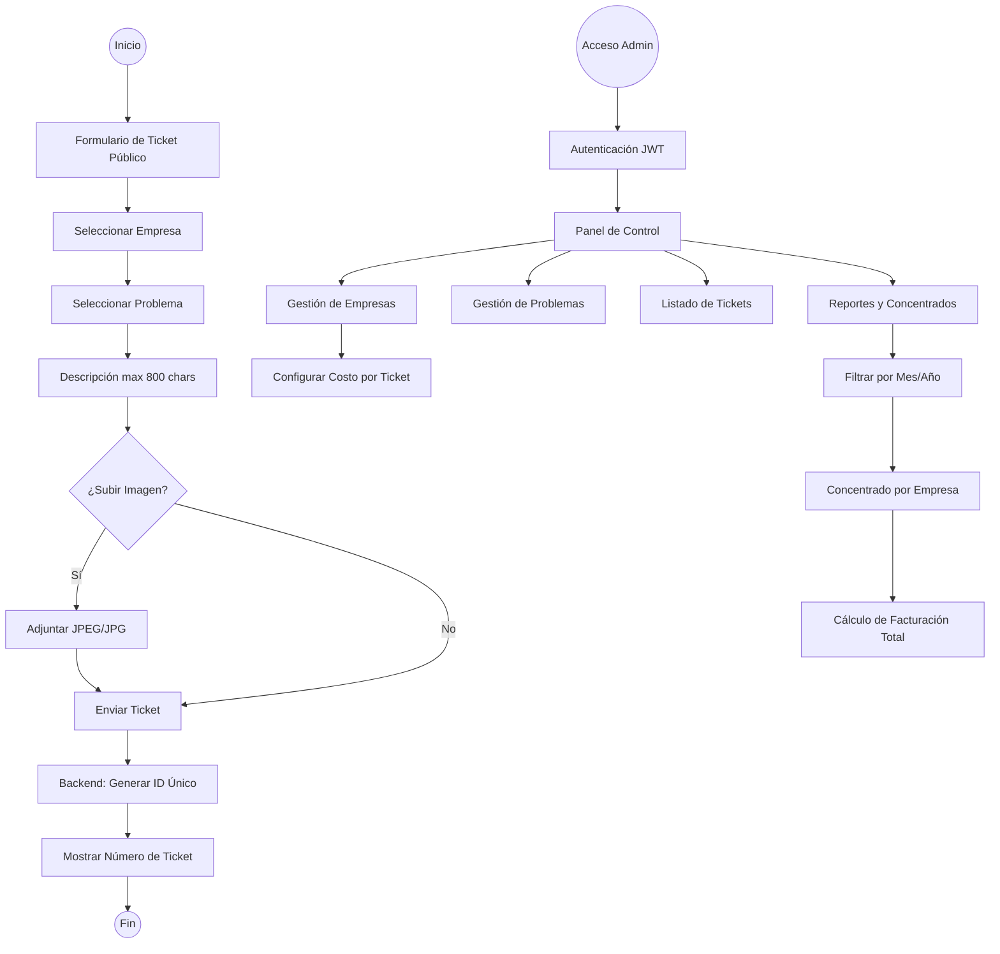

# Diagrama de Flujo: Sistema de Tickets Marmacore

## Características Principales
1. **Lógica de Numeración**: `PREFIJO-AAAAMMDD-SEQ` (ej: MARMA-20240407-0001).
2. **Branding**: Paleta de colores Marmacore (Naranja #FD5200, Teal #00272E, Jakarta Sans).
3. **Tecnología**: MongoDB, Express, React, TypeScript.
4. **Resumen Financiero**: Concentrado mensual automático basado en el costo configurado por empresa.
